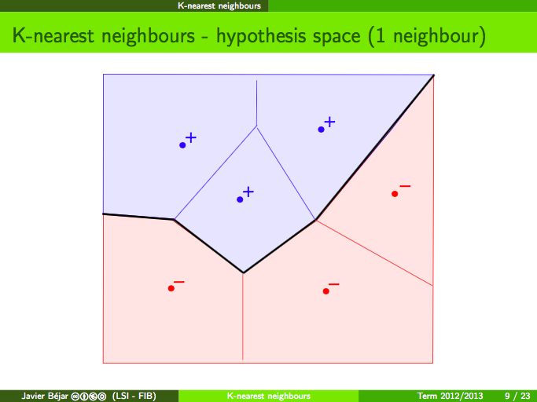
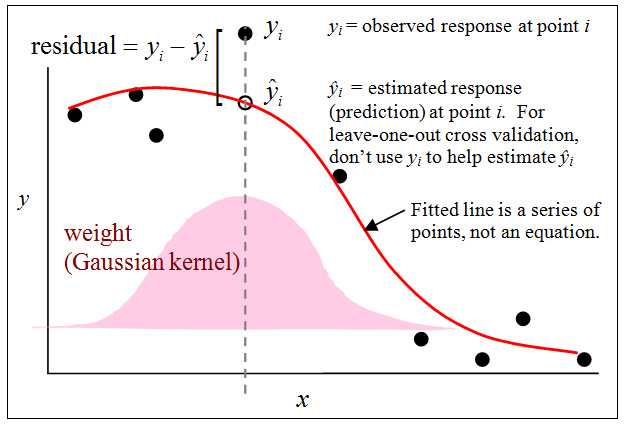
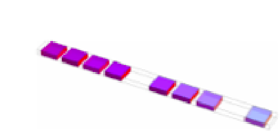
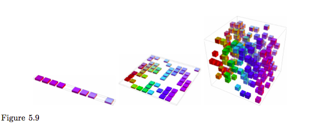
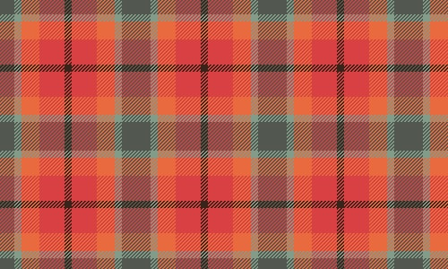
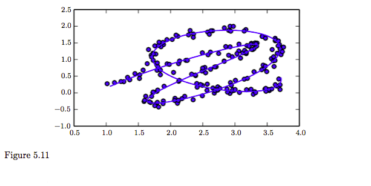
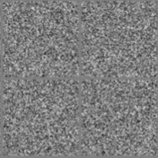

class: center, middle
## Deep Learning Book $\S 5.10 - 5.11$
#### Apr.26 Takeshi Teshima (M1)

---
### Overview
These sections are mostly conceptual.

##### 5.10 Building a Machine Learning Algorithm
- A Learning machine = data + loss + model + optimizer

##### 5.11 Challenges Motivating Deep Learning
- History of fighting for "generalization."
- The Curse of Dimensionality: a pitfall on the way to generalization.
- Principle that deep models employ to workaround "the curse."
<!-- ##### 5.11.1 The Curse of Dimensionality -->
<!-- - Dimension higher $\leadsto$ generalization more difficult -->

<!-- ##### 5.11.2 Local Constancy and Smoothness Regularization -->
<!-- - The curse of dimensionality --- traditional ML methods suffer from it. -->
<!-- - Deep learning won't suffer (with mild assumptions). -->

<!-- ##### 5.11.3 Manifold Learning -->
<!-- - Most data don't distribute over the whole space (e.g. $\mathbb{R}^d$) but on a low-dimensional "manifold". -->
<!-- - Some DL algorithms make use of the manifold. -->

---
class: center, middle
### $\S$ 5.10 Building a Machine Learning Algorithm
---
#### 5.10 Building a Machine Learning Algorithm
##### Summary
This section is just to help you organize in your mind many different machine learning ideas.

##### Recipe of learning machines
A learning machine =
.center[
1. Specification of a dataset +
1. Model +
1. Cost function +
1. Optimization procedure
]

(We will quickly go through 4 examples.)
---
#### [ex. 1/4] Recipe of linear regression
1. Spec. of a dataset
    - $(x\_i, y\_i)$ supervised learning
    - $x$: predictor variable ($d$ dimensional), $y$: predicted variable
1. Model
    - $p\_{model}(y | x) = \mathcal{N}(y; x^T w + b, 1),\quad w \in \mathbb{R}^d, b \in \mathbb{R}$
1. Cost function
    $$\begin{split}J(w, b) &= - E\_{(x, y) \sim \hat p\_{data}} [\log p\_{model}(y | x)]\\\\ &\left(= \frac{1}{n}\sum_{i=1}^n (x\_i^T w + b - y\_i)^2 \quad (+ \text{const.})\right)\end{split}$$
1. Optimization procedure
    - Closed-form solution
    - $\hat v = (X^TX)^{-1}X^Ty$ , where $X = (\mathbb{1}, x\_1, ..., x\_n)^T, \hat v = (\hat b, \hat w\_1, ..., \hat w\_d)^T.$
---
Likewise...
#### [ex. 2/4] Recipe of linear regression w/ regularization
1. Spec. of a dataset
    - $(x, y)$
1. Model
    - $p\_{model}(y | x) = \mathcal{N}(y; x^T w + b, 1)$
1. Cost function
    $$\begin{split} J(w, b) &= - E\_{(x, y) \sim \hat p\_{data}} [\log p\_{model}(y | x)] + \lambda \\|w\\|\_2^2 \\\\ &\left(= \frac{1}{n} \sum_{i=1}^n (x\_i^T w + b - y\_i)^2 + \lambda \\|w\\|\_2^2 + \text{const.}\right)\end{split}$$
1. Optimization procedure
    - Closed-form solution
    - $\hat w = (X^TX - \lambda I)^{-1}X^Ty$ , where $X = (\mathbb{1}, x\_1, ..., x\_n)^T$
---
Likewise...
#### [ex. 3/4] Recipe of nonlinear regression
1. Spec. of a dataset
    - $(x, y)$
1. Model
    - $p\_{model}(y | x)$
    - e.g. Sigmoid: $p\_{model}(y|x) = \frac{1}{1 + \exp{- w^T x}}$
1. Cost function
    - $J(w, b) = - E\_{(x, y) \sim \hat p\_{data}} [\log p\_{model}(y | x)]$
1. Optimization procedure
    - (Often) no closed form
    - e.g. Gradient descent

---
Likewise...
#### [ex. 4/4] Recipe of PCA (first principal component vector)
1. Spec. of a dataset
    - $x$ (with $\bar x = 0$)
    - unsupervised
1. Model
    - $\\|w\\| = 1$
    - $r(x; w) = w^T x w$ (Reconstruction function)
1. Cost function
    $$\begin{split}J(w) &= E\_{x \sim p\_{data}}\\|x - r(x; w)\\|^2 \\\\ &= \frac{1}{n} \sum_{i=1}^n  \\|x\_i - w^T x\_i w\\|^2\end{split}$$
1. Optimization procedure
    - Corresponds to finding the first eigenvector of $\sum_{i=1}^n (x\_i x\_i^T)$.

---
#### Some comments on the recipe
- Your cost function $J(w)$ takes time to calculate?

    $\leadsto$ try approximating $\nabla J(w)$

    $\leadsto$ (approximate) minimization of $J(w)$ by iterative methods.

- Your algorithm seems unique (doesn't fit the recipe)?

  $\leadsto$ usually understood as using a special-case optimizer.

---
#### Examples of models with a hand-made optimizer
- Decision tree
    - Decision of which feature to use is required: discrete parameter

        $\leadsto$ No gradient based methods

- k-means
    - Discrete parameter (Cluster partition)

        $\leadsto$ No gradient based methods

---
##### Decision tree (e.g. entropy as the impurity measure)
1. Data
    - $(x\_i, y\_i) (i = 1, ..., n)$ supervised
    - $x \in \mathbb{R}^d$ : features, $y \in \\{1, ..., k\\}$ : label
1. Model
    - Tree = (Nodes, Edges). Each node has a rule of the form: $\text{(An element of $x$)} \leq \text{(a threshold)} \quad  (\text{or} \geq)$
    - $I(X\_\text{node}) = - \sum\_{j=1}^c \hat p(\text{class} = j | x \in X\_\text{node}) \log\_2 \hat p(\text{class} = j | x \in X\_\text{node})$
    - $\hat p(\text{class} = j | x \in X\_\text{node}) = \frac{n\_{\text{node}, j}}{n\_{\text{node}}}$
1. Cost Function
    - $J(\text{Tree}) = - \sum\_{\text{leaf}}\sum\_{j=1}^k n\_\text{leaf} \times \hat p(j | X\_\text{leaf}) \log\_2 \hat p(j | X\_\text{leaf})$
1. Optimizer
    - Maximize the information gain at each split $I(X\_\text{parent}) - \sum\_\text{child} \frac{N\_\text{child}}{N\_\text{parent}} I(X\_\text{child})$.
    - Continue until all leaves are pure i.e. all the training samples in each leaf are in the same class.
---
.center[]

.center[]
.footnote[Both taken from: S. Raschka, Python machine learning: unlock deeper insights into machine learning with this vital guide to cutting-edge predictive analytics. Birmingham Mumbai: Packt Publishing, 2016.]
---
##### k-means
1. Data
    - $x\_i \in \mathbb{R}^d (i = 1, ..., n)$  unsupervised
1. Model
    - $k \in \mathbb{N}$ given, $S\_1, ..., S\_k \subset \text{(All samples)}$ : MECE
    - $Center(S\_j) = \frac{1}{|S\_j|} \sum\_{x\_i \in S\_j} x\_i$
1. Cost Function
    - $J(S\_1, ..., S\_k) = \sum\_{j=1}^k \sum\_{x\_i \in S\_j} \\|x\_i-Center(S\_j)\\|^2$
1. Optimizer [[Demo]](http://tech.nitoyon.com/ja/blog/2013/11/07/k-means/)
    - Iterative optimization:
        1. Randomly choose a $V\_j \in \mathbb{R}^d$ for each $j$ and assign $x\_i$ to $S\_j$ where $j = \mathop{\rm arg~min}\limits\_{j'} \\|x\_i - V\_{j'}\\|^2$.
        2. Calculate $Center(S\_j)$ for each $j$
        3. Assign each $x\_i$ to $S\_j$ if $j = \mathop{\rm arg~min}\limits\_{j'}\\|x\_i - Center(S\_{j'})\\|^2$.
---
### Summary of $\S 5.10$
#### Recipe:
A learning machine =
1. Specification of a dataset +
1. Model +
1. Cost function +
1. Optimization procedure

When you encounter a brand new algorithm, consider this recipe to organize your mind.
<!-- --- -->
<!-- #### (Deep learning recipe; Teshima's blueprint) -->
<!-- 1. Spec. of a dataset -->
<!--     - Depends on the task -->
<!-- 1. Cost function -->
<!--     - Prediction / Classification error -->
<!-- 1. Optimization procedure -->
<!--     - Back propagation ? -->
<!-- 1. Model -->
<!--     - Layers of linear functions and activation functions. -->
<!--     - Output: prediction / recognition result -->

---
class: center, middle
### $\S$ 5.11 Challenges Motivating Deep Learning
---
class: center, middle
### Machine learning is a fight for "generalization."

<!-- #### [Summary in advance] 5.11 Challenges Motivating Deep Learning -->
<!-- This section tries to explain what really is special about deep models. -->
<!-- ##### The fight for "generalization" -->
<!-- - Conventional workarounds for generalization: -->
<!--     - smoothness assumption (or "prior" in the book) -->
<!--     - local constancy assumption -->
<!-- - However, in high dimension, they're not enough! ... Why? -->

<!-- ##### Because of The Curse of Dimensionality -->
<!-- High dimension $\leadsto$ even a smooth function needs many samples (to generalize). -->

<!-- ##### Deep models make a difference. -->
<!-- - Find simple rules (like "periodicity"). -->
<!-- - Assumption: data was generated by the composition of factors. Potentially at multiple levels in a hierarchy. -->
Generalization: learning a function $f$ that gives "a fairly good answer," $y$, for an unknown example $x$.
---
### Conventional workaround for generalization
Conceptually, many algorithms use one of the following two assumptions to achieve generalization.

#### Local constancy and local smoothness

- Optimal $f$ would satisfy: $f(x) = f(x+ \epsilon)$
- Optimal $f$ would satisfy: $f(x) \approx f(x+ \epsilon)$

However, these assumptions don't scale to high dimensional settings.

We will quickly see 3 examples of these assumptions.

---
#### Local constancy example: $k$-nearest neighbors
- Learned function $f$ predicts label according to the nearest $k$ sample points.
- Assumes local constancy of $f$.

.center[]
<!-- .center[] -->
---
#### Local smoothness example: Kernel machines (local kernels)
- Employs a local kernel $k(u, v)$: large when $u = v$, decreases as $u$ and $v$ are farther apart
- Kernel regression: more weights on samples in the neighborhood. (Local template matching): $f(x) = \sum_{i=1}^n \theta\_i \phi(x, X\_i)$

.center[]

.footnote[By Brmccune - Own work, CC BY-SA 3.0, https://commons.wikimedia.org/w/index.php?curid=17877129]
<!-- --- -->
<!-- #### Local smoothness example: Decision trees -->
<!-- - (\# of Regions) = (\# of leaves) $\leadsto$ You need as many leaves -->
<!-- - Parameters for each branching $\leadsto$ grows accord. to depth $\leadsto$ grows exponential to the number of leaves $\leadsto$ grows exponential to the number of regions -->

---
class: center, middle
### Caveat: local constancy and smoothness are not enough (as assumption) in high dimension.
Because there will be many regions without training samples.

This is what is called "the curse of dimensionality."
---
#### 5.11.1 The Curse of Dimensionality
#### How local constancy and local smoothness fail:

<!-- When there were only fewer cells, things were much easier: -->
<!-- .center[] -->

<!-- ##### Other examples of local constancy / local smoothness -->
<!-- - Want to estimate the probability density at $x$ ? -->
<!--     - $\leadsto$ just return $\frac{(\text{# training examples in the cell } x)}{(\text{# all training examples})}$. -->
<!-- - Classify an example? -->
<!--     - $\leadsto$ return the most common class in the same cell. -->
<!-- - Regression? -->
<!--     - $\leadsto$ Average the target values observed in that cell. -->

<!-- --- -->
<!-- #### The pitfall to traditional workarounds: The Curse of Dimensionality -->
Dimensionality high $\Rightarrow$ Sample points occupy less proportion of regions

.center[]

- The number of regions $\approx O(v^d)$
    - $v$ = (the number of possible values for each dimension)
    - $d$ = (the dimension of $x$)

---
class: center, middle
### Locality will not work in high dimension
Insufficient samples $\Rightarrow$ locality will not work... (Low generalization)

Now, how to overcome "the curse ?"
---
#### How to overcome the curse of dimensionality?
#### Insight:

- Conventional learning machines treat each training sample as if it only informs the learner about how to generalize in its neighborhood.
---
#### How to overcome the curse of dimensionality?
#### Idea for a workaround

- Find simple rules
- e.g. Checkerboard: you can find periodicity

.center[]

- $x$ : position   $\quad f(x)$ : color

#### Samples in many (27 $\times$ 18) cells can be predicted with only 5 $\sim$ 6 rules $\leadsto$ Learn such a rule from samples
---
#### New principle for generalization, which avoids the curse
#### Assumption:
- The data was generated by .red[the composition of factors or features], potentially at multiple levels in a hierarchy.

#### Is this assumption sufficient?
- Apparently a mild assumption, but works very well.

- In fact, the generalizability is exponential to $n$ (the sample size). More in $\S$ 6.4.1, $\S$ 15.4, $\S$15.5.
---
#### (For reference) How other approaches to machine learning avoid the curse of dimensionality
Make task-specific assumptions.

For example, we could easily solve the checkerboard task by providing the assumption that the target function is periodic.

---
class: center, middle
### New principle: Learn simple rules from training samples

Now, how do we express or formulate "simple rules?"

Or, does the world really have "simple rules?"

That's where the "manifold hypothesis" comes in.
---
### 5.11.3 Manifold Learning
How to learn / represent / formulate “simple rules”?
#### Hypothesis: In the real world, meaningful data don't distribute over the whole space.
.center[]

Therefore: "Find simple rules in the data" $\approx$ "Find the essential coordinate."

---
#### Manifold Hypothesis
"Data don't distribute uniformly within the whole $\mathbb{R}^n$. They lie on a lower-dimensional manifold in $\mathbb{R}^n$."

\+ "interesting change occur only along the manifold / only when moving from one manifold to another."

##### Note: Here, the term "manifold" is casually used:

- A manifold $\approx$ "a connected set of points that has only a small dimension, embedded in a higher-dimensional space."
- Different dimensions around each point are allowed. e.g. crossing (allow the existence of singular points in the data manifold)
.center[]

---
#### Cf. Existing methods for finding the coordinate: Manifold Learning
Manifold learning was introduced in the case of
- continuous-valued data + unsupervised

However, extendable to:
- discrete data
- supervised learning

---
#### Justification for the manifold hypothesis
Can we trust this principle?
##### 1. Real world data seems low-dimensional.
- The probability distribution over images, text strings, and sounds that occur in real life is highly .red[concentrated].
- Uniform noise essentially never resembles structured inputs from these domains:
.center[]

- The distribution of natural language sequences occupies a very small volume in the total space of sequences of letters
---
#### Justification for the manifold hypothesis
Can we trust this principle?
##### 2. Real world data seem to have a local coordinate.
The data are likely to form a small number of manifold (i.e. every point $p$ has a Euclidean-like neighborhood)
- we can imagine .red[neighborhoods] and .red[transformations].
- we can imagine .red[gradual modifications] (dim / brighten the lights, move / rotate objects, alter the colors, etc.).

##### Remark
It remains likely that there are multiple manifolds involved in most applications.
- For example, the manifold of images of human faces may not be connected to the manifold of images of cat faces.

---
#### Justification for the manifold hypothesis
Can we trust this principle?
##### 3. (According to the book) More rigorous experiments clearly support the hypothesis for a large class of datasets of interest in AI.
- Cayton, 2005
- Narayanan and Mitter, 2010
- Schölkopf et al., 1998
- Roweis and Saul, 2000
- Tenenbaum et al., 2000
- Brand, 2003
- Belkin and Niyogi, 2003
- Donoho and Grimes, 2003
- Weinberger and Saul, 2004

---
##### How to employ the assumption?
Find the essential coordinate (representation).

Challenging, but this should improve many machine learning algorithms.

##### Ex. Variational Auto Encoder (VAE) successfully finds the coordinate (Fig. 20.6).
A VAE generated the following; the internal expression of this VAE has a "meaning" in two different dimensions (rotation & facial expression).
.center[]

---
### Summary of $\S 5.11$
- Locality is not a useful assumption in high dimensional setting because training samples will be sparse = the curse of dimensionality.
- Deep learning avoids the curse of dimensionality by incorporating representation learning.
    - we believe it's possible due to manifold hypothesis: the world has simple (i.e. low-dimensional) rules.

<!-- ### You are now prepared to embark upon your study of deep learning : ) -->
