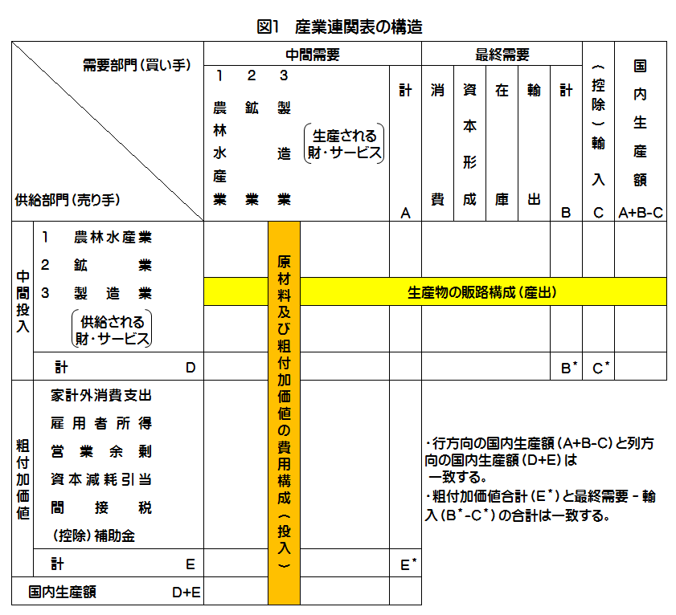
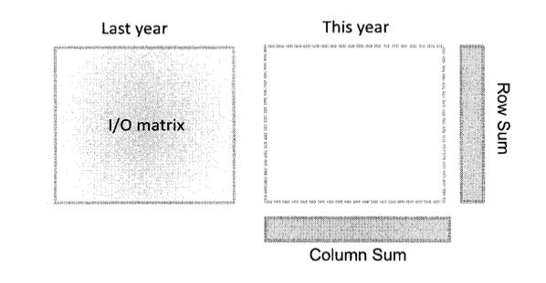
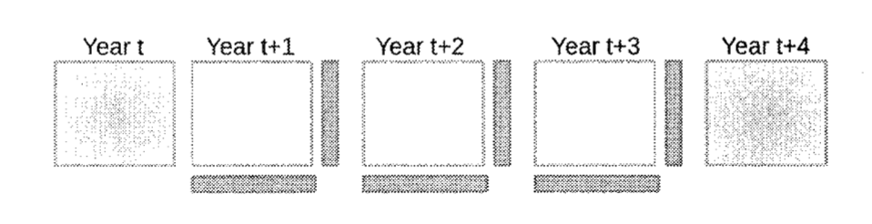
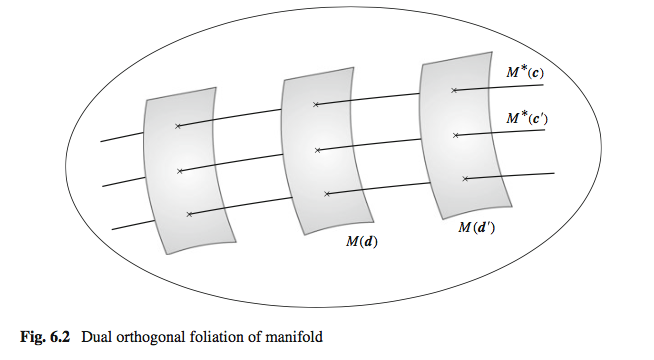
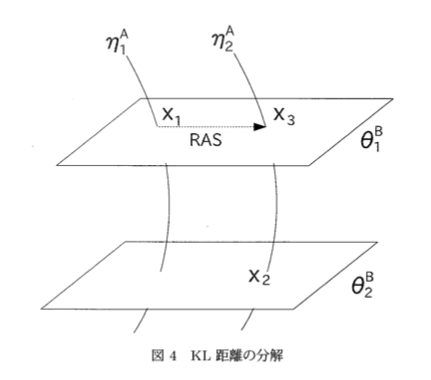
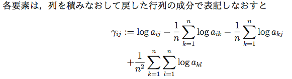
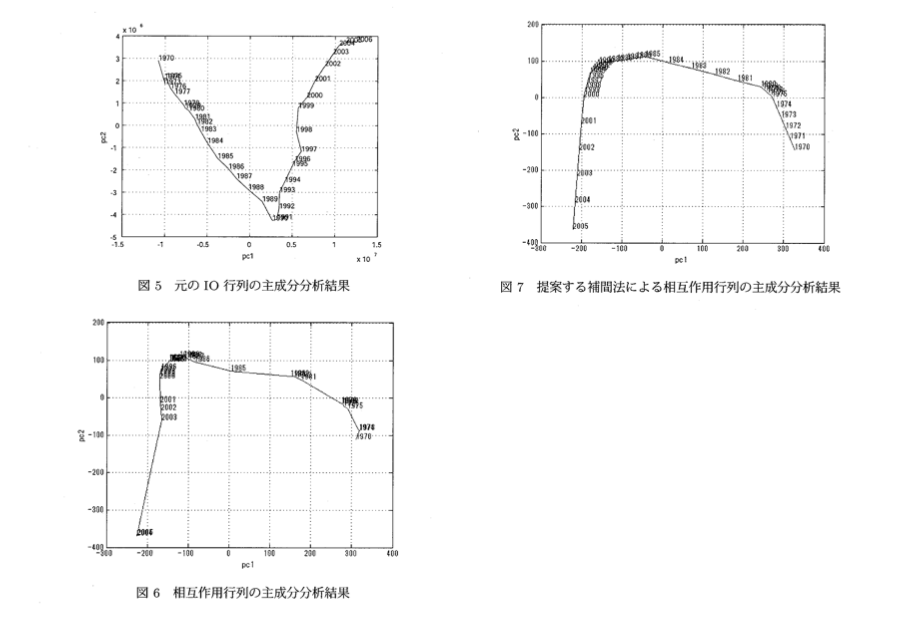

class: center, middle

# 産業連関表の情報幾何
---
#### Preliminaries
藤原彰夫, 『情報幾何学の基礎』. 牧野書店, 2015.

#### Reference
[1]森岡涼子と津田宏治, 「産業連関表の情報幾何(ネットワーク,テキスト・Webマイニング,一般)」, 電子情報通信学会技術研究報告. IBISML, 情報論的学習理論と機械学習, vol. 110, no. 476, pp. 161–167, 2011.
[2]S. Amari, Information Geometry and Its Applications, vol. 194. 2016.
[3]森岡涼子と津田宏治, 「情報幾何的分解に基づく地方産業連関表の将来推計」.

---

## 産業連関表

### 産業連関表 (Input Output Table; 以下 IO table)とは
#### 概要
* 作成者：10省庁が共同で作成
* 原則5年ごとに出る
* 「産業部門」(行)から「産業部門」(列)への財・サービス投入量 をまとめたもの(金額ベース)

.right[source: [http://www.soumu.go.jp/toukei_toukatsu/data/io/c_method.htm](http://www.soumu.go.jp/toukei_toukatsu/data/io/c_method.htm)]
#### 図
次ページ
---

---
### 定式化
考えうる IO table 全体の集合$\chi$
$$
\chi := \\{A \in \mathbb{R}^n | A_{ij} > 0, \forall i, j\\}
$$

---
### 情報幾何が補完に使える
* IO table は，5年に1度しか出ない
* その期間は，他の統計から周辺和だけ分かる:
$A\_{i \cdot} \quad A\_{\cdot j} \quad A\_{\cdot \cdot}$
.center[]
.center[]
---
### 情報幾何が補完に使える
#### 既存の補完方法：RAS
昨年の表 $A$ から今年の表 $B$ を推定
今年の表は周辺和だけ分かっている

#### アルゴリズム
1. $A$に行ごとに係数をかけ，行和が$B$のそれと同じになるようにする
2. 今度は列ごとに係数をかけ，列和が$B$のそれと同じになるようにする
3. 周辺和が一致するまで繰り返す

問題点：「産業構造」を固定することで補完している(ことが，後でわかる)．
→ 情報幾何で，産業構造の変化を表現できるようにする．

---
### 情報幾何の復習
* 最初にあるもの
    * $(M, g, \nabla, \nabla^\*)$ : $n$-dim. $C^\infty$- Riemann mfd.
        * $g$: Riemann計量
        * $\nabla$: ($TM$上の)接続
* 誘導されるもの
    * $\nabla^\*$: ($TM$上の)双対接続 i.e.
        * $\forall X, Y, Z \in \Gamma(TM), X g(Y, Z) = g(\nabla_X Y, Z) + g(Y, \nabla^\*_X Z)$
        * 一意
---
### 情報幾何の復習
* もし $\nabla, \nabla^\*$ の両方について $M$ が平坦 (i.e. $R = R^\* = 0, T = T^\* = 0$)ならば 誘導されるもの
    * (局所)双対アファイン座標系 $((\theta^i), (\eta_i))$ i.e.
        * $\Gamma\_{ij}^k = \Gamma\_{ij}^{\* k} = 0$ かつ $g(\frac{\partial}{\partial \theta^i}, \frac{\partial}{\partial \eta\_j}) = \delta^i\_j$
    * それらのポテンシャル関数 $\\{\psi(\theta^1, ..., \theta^n), \varphi(\eta_1, ..., \eta_n)\\}$ s.t.
        * $\eta\_i = \partial\_i \psi, \theta^i = \partial^i \varphi, \psi(\theta) + \varphi(\eta) - \theta^i \eta_i = 0$
        * 狭義凸，$C^\infty$
    * ダイバージェンス $D(p||q)$ i.e.
        * $D(p||q) := \psi(\theta(p)) + \varphi(\eta(q)) - \theta^i(p) \eta_i(q)$

---
### 情報幾何の復習
#### __Thm__ 拡張 Pythagoras の定理
$(M, g, \nabla, \nabla^\*)$ が双対平坦だとして，双対アファイン座標系が得られたとする．

これらの座標系の共通部分において，$p, q, r \in M$ をとる．
もし $\nabla$ - 測地線 $pq$ と $\nabla^\*$ - 測地線 $qr$ が($q$ において $g$ について)直交しているなら，
$$
D(p || q) + D(q || r) = D(p || r)
$$

直交の定義: $q$ でのこれらの椄ベクトル$\partial\_1, \partial\_2$に対し，$g(\partial\_1, \partial\_2) = 0$

注意: $\nabla$ - 測地線は $\theta$ 座標系の直線，$\nabla^\*$ - 測地線 は $\eta$ 座標系の直線．
---
### 情報幾何の復習
#### 双対葉層化
$(\theta^i), (\eta_j)$ : 双対アファイン座標系 ($\nabla \leadsto \theta, \nabla^* \leadsto \eta$)

$\leadsto$
それぞれ，最初の $k$ 座標と，残る $(n-k)$ 座標で分割し，以下のように混ぜる
$$
\xi := (\eta\_1, ..., \eta\_k, \theta^{k+1}, ..., \theta^n)
$$

$\leadsto$ 以下の方法で，双対葉層化ができる．

新しい座標系で，接空間の基底を
$$
e^i = \frac{\partial}{\partial \eta_i}, \quad i = 1,..., k \\\\
e_j = \frac{\partial}{\partial \theta^j}, \quad j = k+1,...,n
$$
でとると，$e^i$ と $e_j$ は直交する ($\because g(e^i, e_j) = 0,\ i \neq j$)．
---
### 情報幾何の復習
#### 双対葉層化
いま，$\xi$ の最初の $k$ 個の座標を $c = (c_1, ..., c_k) \in \mathbb{R}^k$ で固定して残りを自由に動かすと，$(n-k)$ 次元の部分多様体を得る：
$$
M^\*(c) := \\{p \in \chi\ |\ (\xi^1(p), ..., \xi^k(p)) = c \\}
$$

$\leadsto$ このとき，
* $M^\*(c)$ は $\nabla^\*$ - 自己平行になる
    * ($\because M^\*(c)$ の座標 $(\xi^{k+1}, ..., \xi^n)$ は $M$ の $\nabla^*$ - アファイン座標系 $\xi$)．
* $(\xi^{k+1}, ..., \xi^n)$ は $M^\*(c)$ の $\nabla^\*$ - アファイン座標系になる
* $M^\*(c) \cap M^\*(c') = \emptyset, \quad c \neq c'$ (演習: why?)
* $M = \bigcup_{c \in \mathbb{R}^k} M^\*(c)$ (演習: why?)
---
### 情報幾何の復習
#### 双対葉層化

---
### 情報幾何の復習
#### 双対葉層化
同様に $\theta^{k+1}, ..., \theta^n$ を $d \in \mathbb{R}^{n-k}$ に固定して $\xi$ をいろいろ動かすと
$$
M(d) := \\{p \in \chi\ |\ (\xi^{k+1}(p), ..., \xi^n(p)) = d \\}
$$
という $k$ 次元の $\nabla$ - 自己平行な部分多様体が得られる．

#### Prop
$M(d)$ と $M^\*(c)$ は直交する ($\forall c, d$)．

_(Proof)_ 演習

---
### 情報幾何の復習
#### 双対葉層化
#### Prop
* $p, q \in M$
* $r\_{pq}$ : $p$ の $M(\theta\_q)$ への $m$ - 射影

    (ただし $\xi$ 座標を $\xi\_p = (\eta\_p ; \theta\_p), \xi\_q = (\eta\_q ; \theta\_q)$ とする)

とすると，
<!-- (このとき $p \in M^\*(\eta\_p) \cap M(\theta\_p)$, $q \in M^\*(\eta\_q) \cap M(\theta\_q)$ である) -->
<!-- ($D$ を最小化するような$M(\theta\_q)$の点; 実は $\nabla$ 測地線を $M(\theta\_q)$に垂直に下ろした交点) -->

正準ダイバージェンス (双対平坦な多様体上で，先の方法で構成したダイバージェンス) は，
$$
D(p || q) = D(p || r\_{pq}) + D(r\_{pq} || q)
$$
と分解できる．
---
.center[]
---
## 双対座標の導入
#### Setting
$n \geq 2$ とする． $N := n^2$ とおく．

$\chi := \\{A \in M(n, \mathbb{R}\_+) | A_{ij} > 0, \forall i, j = 1,..., n\\}$ : IO table の全体

$A \in \chi$ に対して

* $a := vec(A\_{ij})$ : $a$座標
(ただし $vec(A)$ は列を縦に積み上げた $N$ 次元ベクトル)

をとれる．しかし以下の理由から，「周辺和」と「それ以外の情報」を分けたい．

* IO table が出ない年度でも，周辺和の情報だけは分かる．
* 周辺和は，各産業の「規模」に比例して大きくなると考えられるので，意味論上は「周辺和」は「規模」を，「それ以外」は「産業間の相互作用」を表現すると期待される．
* 周辺和とそれ以外で情報を分離すれば，補間を「それ以外」の部分に限定して実行できる
---
## 双対座標の導入
#### Setting
「周辺和」と「それ以外の情報」を分けたい．

$\leadsto$
* $(\eta\_i)\_{i = 1}^N$: $\eta$ 座標 を
    * $\eta\_i = A\_{i \cdot} \ (i = 1, ..., n)$ (i.e. $\eta\_1, ..., \eta\_n$が行和)
    * $\eta\_{n + j} = A\_{\cdot j} \ (j = 1, ..., n)$ (i.e. $\eta\_{n+1}, ..., \eta\_{2n}$が列和)

をみたすようにとり，$\eta$ が $\nabla^\*$ - アファイン座標系 $\eta$ になるように $\nabla^\*$ 接続と，その双対を入れる．

##### 実際には
$$
C\_i := (\text{$i$行目は全て1,それ以外は0の$(n \times n)$ 行列}), \\\\
D\_j := (\text{$j$列目は全て1,それ以外は0の$(n \times n)$ 行列}), \\\\
$$
とし，
---
### 双対座標の導入
$$
b\_1 := \mathbb{1}, \\\\
b\_i := vec(C\_i)\quad (i = 2, ..., n), \\\\
b\_j := vec(D\_j)\quad (j = n+1, ..., 2n-1), \\\\
$$

とおき，残る $b\_{2n}, ..., b\_N$ は，
$$
B := (b_1, ..., b_N)
$$
が正則となるようにとる．

すると，
$$
A\_{\cdot \cdot} = a' b\_1, \\\\
A\_{i \cdot} = a' b\_i \quad (i = 2, ..., n), \\\\
A\_{\cdot j} = a' b\_{j - n} \quad (j = n+1, ..., 2n-1), \\\\
$$
となっている．
---
### 双対座標の導入
結果，
$$
\eta := B' a
$$
と置けば，$\eta\_1, ..., \eta\_{2n-1}$ は周辺和の情報を持つ．
<!-- (残り1つの周辺和: $A\_{\cdot n}$または$A\_{1 \cdot}$ は変化してしまう) -->

$\leadsto$ 双対葉層化を使える！
---
### 双対座標の導入
$\eta$座標は$a$座標の線型変換で作られた．

$\leadsto$ $a$座標が双対アファイン座標の一方となるような双対構造があれば，$a$ 座標に $B$ を掛け，その双対座標に $B^{-1}$をかければ，また双対アファイン座標系が得られる (しかもダイバージェンスは変わらない)．
---
### 双対座標の導入
$A := a$ に対して，実は $L := \log A$ (element-wise) 座標が双対アファイン座標になる．

このとき，
$$
\tilde \psi(L) := \sum\_{i=1}^N \exp \\{L\\}, \\\\
\tilde \varphi(A) := \sum\_{i=1}^N A\_i \log A\_i - A\_i
$$
ととれば各点で $\tilde \psi(L) + \tilde \varphi(A) - L'A = 0$ が成立する．

このとき，誘導されるダイバージェンスは，
$$
D(p || q) = \tilde \psi(L(p)) + \tilde \varphi(A(q)) - L(p) ' A(q)
$$
と表される(これは，双対アファイン座標系や$\tilde \psi, \tilde \varphi$のとり方によらない)．

---
### 双対座標の導入
よって，さきの $\eta := B' a$ に対して，
$$
\theta := B^{-1} \log a, \\\\
$$
ととれば，(対応する $\psi, \varphi$ は先ほどのものとは異なるが，ダイバージェンスの計算にはさきの$(L, A)$の座標を使えばよく)
ダイバージェンスは元のまま，
$$
\forall A, B \in \chi, \quad D(A || B) = \sum_{i=1}^N A_i \log \frac{B_i}{A_i} - A_i + B_i
$$
($(L, A)$の座標は$\chi$の全体にわたるので，どの二点に対しても使える)
---
### 双対葉層化
この$(\theta, \eta)$ で葉層化

$\xi := (\eta\_1, ..., \eta\_{2n-1}, \theta^{2n}, ..., \theta^N)$

として，$\eta$ 成分を$c$に固定して$\theta$成分を動かした部分多様体 $M^\*(c)$ と，$\theta$成分を$d$に固定して$\eta$ 成分を動かした $M(d)$を考え，$\chi$ 全体を葉層化する．

実は，RAS法は，e-射影になっている．
$$
R(A, S) = \text{argmin}\_{x} D(x || A) \quad\text{s.t.}\quad \sum\_{i=1}^n x\_i (b\_k)\_i = S\_k (k = 1, ..., 2n-1)
$$
($A \in \chi$にRASをかけて，周辺和$S \in \mathbb{R}^{2n-1}$ を満たすようにする最適化)

---
.center[]
---
### ダイバージェンスの分解
$$
D(p || q) = D(p || r\_{pq}) + D(r\_{pq} || q)
$$
.center[]

---
### ダイバージェンスの分解
* RASはe-射影 $\leadsto$ $M(\theta^{2n}, ..., \theta^N)$ 上の$\nabla$測地線に沿った射影．
* $M(\theta^{2n}, ..., \theta^N)$ 上の測地線は $M(\theta^{2n}, ..., \theta^N)$ から出ない．

$\leadsto$ $\theta^{2n}, ..., \theta^N$ はRAS不変量になっている．

この$\theta^{2n}, ..., \theta^N$を，「相互作用行列」として使う($N - 2n + 1 = (n-1)^2$ 成分ある)．

---
### 相互作用行列
$$
\log A = (b\_1, ..., b\_{2n-1}) (\theta^1, ..., \theta^{2n-1})' + (b\_{2n}, ..., b\_N) (\theta^{2n}, ..., \theta^N)'
$$
だったので，($b\_{2n}, ..., b\_N$の取り方によっていろいろ作りうるが)

.left[]
---
### 提案手法
* 相互作用行列が離れた2時点で与えられたとき，間のIO tableの相互作用行列については線型補完する．

* 相互作用行列と，$\eta\_1, ..., \eta\_{2n-1}$ が与えられたら，元の行列を復元できる：
    * $\theta^B := (\theta^{2n}, ..., \theta^N)$ ， $\eta^A := (\eta\_1, ..., \eta\_{2n-1})$ とすると
    * $A = R(\exp(\theta^B), (\eta^A))$ で復元できる

* これを利用して，IO tableが発表されない年度の産業連関表を復元する．
---
### 実データで実験
* 経済産業研究所の日本産業生産性データベース
* 197年および1973から2006年の 内生部門中問投入行列の実質値

1. RAS(既存手法)から推定された行列 $\leadsto$ 相互作用行列を図示
2. 相互作用行列を先に計算し，線型補完したものを図示(提案手法)
---
.left[]
