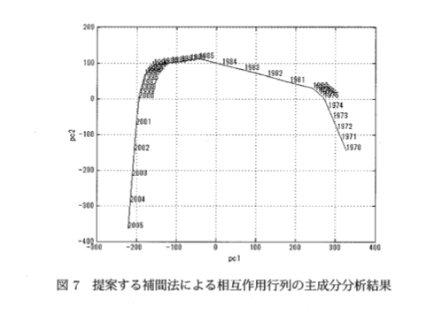

class: center, middle

# 産業連関表の情報幾何
# 事後補足資料 (20170401)
---
## 行和と列和の関係について
行和の和と列和の和は一致します．これは産業連関表の構造とは関係ないことで，単にどちらも成分を全て足した $A\_{\cdot \cdot }$にほかならないから一致します．

そのため，$2n$個ある行和と列和 (あわせて周辺和) は，実際は $2n-1$ 個の数を指定すれば，組として決まります．
ただし発表中では，周辺和のうち$2n-1$個を指定した座標をとる代わりに，周辺和を$2n-2$個，加えて全体和 $A\_{\cdot\cdot}$を指定する座標をとりました．

IO table の成分に制約があるわけではないので，産業連関表全体の空間は，$\mathbb{R}\_+^N$ の(真の)部分空間になっているわけではなく，$\mathbb{R}\_+^N$ の全体です．

RASの例示で収束しなかったのは，指定した行和と列和の組がありえないものだったためでした．

---
### 導入した双対構造の整理
双対構造を天下り的に与えるとすれば以下の通りです．
##### 1. 多様体
* $M = \chi = \\{A \in \mathbb{R}\_+^N | A_i > 0, i = 1, ..., N\\}$
* $(A\_i)\_{i=1}^N$ は$M$の大域的な座標．

##### 2. 計量 $g : \Gamma(TM) \times \Gamma(TM) \to C^\infty(M)$ を以下で定める．
* $i = j$ のとき$g(\frac{\partial}{\partial A_i}, \frac{\partial}{\partial A_j}) = \frac{1}{A_i}$
* $i \neq j$ のとき$g(\frac{\partial}{\partial A_i}, \frac{\partial}{\partial A_j}) = 0$
* 一般の元に対しては線型に拡張．

---
### 導入した双対構造の整理
##### 3. $TM$の接続 $\nabla^\*$を以下で定める．
* $\nabla^\*\_{\frac{\partial}{\partial A_i}}\frac{\partial}{\partial A_j} = 0$
* 一般の元 $X, Y, Z \in \Gamma(TM), f \in C^\infty(M)$に対しては，以下を満たすように拡張．
    * $\nabla^\*\_X(Y + Z) = \nabla^\*\_X Y + \nabla^\*\_X Z$
    * $\nabla^\*\_X(fY) = (Xf) Y + f \nabla^\*\_X Y$
    * $\nabla^\*\_{X + Y} Z = \nabla^\*\_X Z + \nabla^\*\_Y Z$
    * $\nabla^\*\_{fX} Y = f \nabla^\*\_X Y$
---
### 導入した双対構造の整理
##### 4. $\nabla^\*$の双対接続($TM$の接続) $\nabla$ を以下で定める．
* $\forall X, Y, Z \in \Gamma(TM), \forall f \in C^\infty(M)$
* $Xg(Y, Z) = g(\nabla\_X Y, Z) + g(Y, \nabla^\*\_X Z)$
* $A$座標での接続係数で表示すると，$\partial\_i g(\partial\_j, \partial\_l) = \Gamma^k\_{ij}g(\partial\_k, \partial\_l) + \Gamma\_{il}^{*k}g(\partial\_j, \partial\_k)$ から
    * $i = j = k$ のとき $\Gamma\_{ij}^k = - \frac{1}{A_i}$
    * それ以外のとき $\Gamma\_{ij}^k = 0$

##### 5. $L^a := \log A_a (a = 1, ..., N)$を新たに座標にとると，これは$\nabla$のアファイン座標になっている：
$\because$座標変換則 $\Gamma\_{ab}^c = \sum\_{i, j, k} \frac{\partial A\_i}{\partial L^a}\frac{\partial A\_j}{\partial L^b}\frac{\partial L^c}{\partial A\_k} \Gamma\_{ij}^k + \sum\_k \frac{\partial^2 A\_k}{\partial L^a \partial L^b}\frac{\partial L^c}{\partial A\_k}$ から

$\Gamma\_{ab}^c = A\_a A\_b \frac{1}{A\_c} 1\\{a = b = c\\} (- \frac{1}{A\_a}) + 1\\{a = b\\} A\_a 1\\{a = c\\}\frac{1}{A\_a}$

$= - 1\\{a = b = c\\} A\_a^2 \frac{1}{A\_a^2} + 1\\{a = b = c\\} A\_a \frac{1}{A\_a}$

$= 0$
---
### 導入した双対構造の整理
##### 6. $(L^a)$と$(A_i)$は実は双対性も満たす：
$\because g(\frac{\partial}{\partial L^a}, \frac{\partial}{\partial A\_i})$

$= \frac{\partial A\_j}{\partial L^a} g(\frac{\partial}{\partial A\_j}, \frac{\partial}{\partial A\_i})$

$ = A\_a g(\frac{\partial}{\partial A\_a}, \frac{\partial}{\partial A\_i})$

$ = \delta^a\_i$

以上の順に双対構造を導入することで，$(M, g, \nabla, \nabla^\*)$ と，対応する双対アファイン座標系一組 $((L^a), (A\_i))$ がとれた．

ここから自動的に，双対な凸関数の組とダイバージェンスが得られる．

(先に入れた接続を$\nabla$ではなく$\nabla^\*$だと思って入れたのは，最終的に得られるダイバージェンスのうち $\nabla$-ダイバージェンスが，KLダイバージェンスと一致することを見越して．)

---
## 周辺和座標を入れる
ここまでで$((L^a), (A\_i))$ という双対アファイン座標系を得たが，実際には周辺和を座標に使いたい．これは$(A\_i)$座標のアフィン変換で得られる．変換に使う行列
$B := (b\_1, ..., b\_N) \in M(N; \mathbb{R}\_+)$
を，
$$
\begin{split}
b\_1 &:= (\text{全ての要素が1のベクトル}) \in \mathbb{R}^N, \\\\
b\_i &:= vec(C\_i) \quad (i = 2, ..., n), \\\\
b\_j &:= vec(D\_j) \quad (j = n+1, ..., 2n-1), \\\\
(b\_{2n}&, ..., b\_N \text{は$B$が正則になるように選ぶ})
\end{split}
$$
と定める．ここで
$$
\begin{split}
C\_i &:= (\text{$i$行目は全て1,それ以外は0の$(n \times n)$ 行列}) \quad(i = 2, ..., n), \\\\
D\_j &:= (\text{$j$列目は全て1,それ以外は0の$(n \times n)$ 行列}) \quad(j = n+1, ..., 2n-1), \\\\
(vec(X) &\text{は，行列$X$を列ごとに積み上げた縦ベクトル}).
\end{split}
$$
(周辺和は$2n$個のうち$2n-1$個が決まれば組として決まるのでこれで十分．$b\_1, ..., b\_{2n-1}$は一次独立であることがすぐ示せる．そのため$N-(2n-1) = (n-1)^2$ 本のベクトルを適当に付け加えて$B$が正則であるようにできる．)
---
## 周辺和座標を入れる
このように $B$ をとると，$A'b\_1 = A\_{\cdot\cdot}, A'b\_i = A\_{i\cdot}, A'b\_j = A\_{\cdot j}$ なので，
$$
\eta := B'A
$$
とすれば $\eta\_1, ..., \eta\_{2n-1}$は周辺和となる．

$\eta$は$A$のアファイン変換で得られたので，ふたたび$\nabla^\*$アファイン座標となる．

(ただし$L$との双対性はない)

$L$に左から$B^{-1}$をかけた座標$\theta$をとれば，同様に$\theta$は$\nabla$アファイン座標で，さらに$\theta$と$\eta$は双対アファイン座標となる．
($g(\partial\_i, \partial^j) = \delta\_i^j$の条件を満たすことがすぐ確かめられる)

---
## 双対葉層化
$\eta$と$\theta$を混合して双対葉層化する：
$$
\begin{split}
\eta^A &:= (\eta\_1, ..., \eta\_{2n-1}), \quad \eta^B := (\eta\_{2n}, ..., \eta\_N), \\\\
\theta^A &:= (\theta^1, ..., .\theta^{2n-1}), \quad \theta^B := (\theta^{2n}, ..., \theta^N), \\\\
\xi &:= (\eta^A; \theta^B)
\end{split}
$$

同じ周辺和$c \in \mathbb{R}^{2n-1}$の行列を集めた$\chi$の部分多様体が，$M^\*(c)$となる．

既存手法「RAS」で行列$A$から周辺和$c$を達成するように得た行列は，$A$の$M^\*(c)$ へのe-射影 ($D$を最小化する射影であり，$\nabla^*$測地線に沿った平行移動でもある)
$$
A \in \chi, S \in \mathbb{R}^{2n-1}, \\\\
R(A, S) = \text{argmin}\_{x} D(x || A) \quad\text{s.t.}\quad \sum\_{i=1}^n x\_i (b\_k)\_i = S\_k (k = 1, ..., 2n-1)
$$
(と実は同じである．次ページ参照)
---
## RASはe-射影
右辺は
$$
\begin{split}
x\_1 &= \text{argmin}\_{x} D(x || A) \quad\text{s.t.}\quad \sum\_{i=1}^n x\_i (b\_1)\_i = S\_1, \\\\
x\_2 &= \text{argmin}\_{x} D(x || x\_1) \quad\text{s.t.}\quad \sum\_{i=1}^n x\_i (b\_2)\_i = S\_2, \\\\
x\_3 &= \text{argmin}\_{x} D(x || x\_2) \quad\text{s.t.}\quad \sum\_{i=1}^n x\_i (b\_3)\_i = S\_3, \\\\
&\vdots
\end{split}
$$
で解けることが保証されている(解の存在の保証は，射影先の部分多様体$M(\theta^B)$はm-平坦であることによる．逐次最適化で解が求まることは，$D$がBregmanダイバージェンスであることによる)．

---
## RASはe-射影
各$k$での最適化の解はLagrange未定乗数法で解けて，
$$
(x\_k)\_i = \begin{cases}
(x\_{k-1})\_i & ((b\_k)\_i = 0) \\\\
\frac{(x\_{k-1})\_i s\_k}{\sum\_{\\{i: (b\_k)\_i = 1\\}} (x\_{k-1})\_i} & ((b\_k)\_i = 1) \\\\
\end{cases}
$$
となり，これはRASの更新式と同じ．
---
## RASはe-射影
e-射影は$\nabla^\*$測地線に沿った平行移動でもある．
$\nabla^\*$測地線は$M(\theta^B)$から出ないので，RASの過程で$\theta^B$は変化しないことが分かる．

これを利用して，相互作用行列をRASを用いて定義する．
---
## 相互作用行列の定義
相互作用行列を，混合座標が以下の $\xi$ であるようなIO table $X$：
$\xi := (\eta^A; \theta^B) = (\eta\_1, ..., \eta\_{2n-1}, \theta^{2n}, ..., \theta^N)$
に対して定義したい．

まず($A$座標で)全ての要素が1であるような $\chi$ の元(架空のIO table) $\mathbb{1}$を考える．意味論から，これは産業構造が最も等質なIO tableであると思われる．

そこで，IO table $X_0 = R(\mathbb{1}, \eta^A)$ を考える．これは周辺和が$X$と同じで，かつ産業構造が$\mathbb{1}$と同じIO tableである．

$X$と$X_0$では，周辺和は等しい(双対葉層構造のうちの同じ一枚である$M^*(\eta^A)$に乗っている)ので，$X$が$X_0$に対してどの程度異なるかが，$X$の産業構造の指標となる．
---
## 相互作用行列の定義
.center[]
そこで 相互作用行列を $\log A - \log A\_0$ で定める．

これは $\theta^B - \theta\_0^B$ に対応する量である．
$$
B\_1 := (b\_1, ..., b\_{2n-1}), B\_2 := (b\_{2n}, ..., b\_N)
$$
とおく．
いま，$A$座標と$\theta$座標の関係は $\log A = B \theta = B\_1 \theta^A + B\_2\theta^B$ であったから，
$B\_2$を$B\_2'B\_1 = 0$(零行列)となるようにとっておけば，
左から$B\_2'$をかけて，$B\_2' \log A = (B\_2'B\_2)(\theta^B - \theta\_0^B)$

(論文中にはモチベーションが十分書かれていないが，恐らくこのような議論による？)
---
## 数値実験と，手法の評価
実データでの利用
1. 相互作用行列に($A$座標で)PCAを施し，最も変動の大きい方向の成分の変化を見た．IO tableが公表されない年度についてはRASによらず，線型補間した．結果，重要なイベントが転換点に対応することが見られた．
(1975 年の第1次オイルショック、1985 年前 後の第 2次オイルシ ョッ ク、1990年前後のバ ブル崩壊期、1998 年前後のアジア金融危機などの社会情勢下における時期に、特 徴の変化が現れている。 また、1970年代から80年台にかけて と、2000 年代以降では変化の 方向が変わっ ており、1990 年代 は、技術革新の方向転換の時期)
.center[]
---
## 数値実験と，手法の評価
2. 相互作用行列は，IO tableの対数変換と差で定義されており，行と列は産業部門に対応を残しているので，ベクトル表示($A$座標)で(成分を)昨年との差を図示すれば産業ごとに構造の変化を可視化できる．
「石油製品」などとある箇所は帯状になっていて，それが石油製品産業への投入(石油製品産業が他産業から購入した金額)になっている．
.center[]

---
## RASの収束性について
RASがe-射影であることは見た．問題はe-射影の存在保証．

* e-射影は，射影先の部分多様体がm-平坦ならば，存在する．
* e-射影は，逐次最適化によって実行できる(最適解に収束する)

という2つの結果から，RASが収束することが従う．
