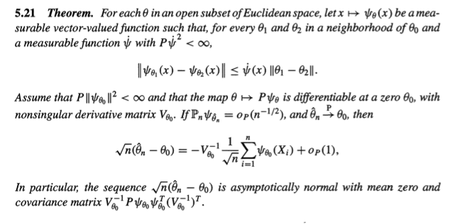
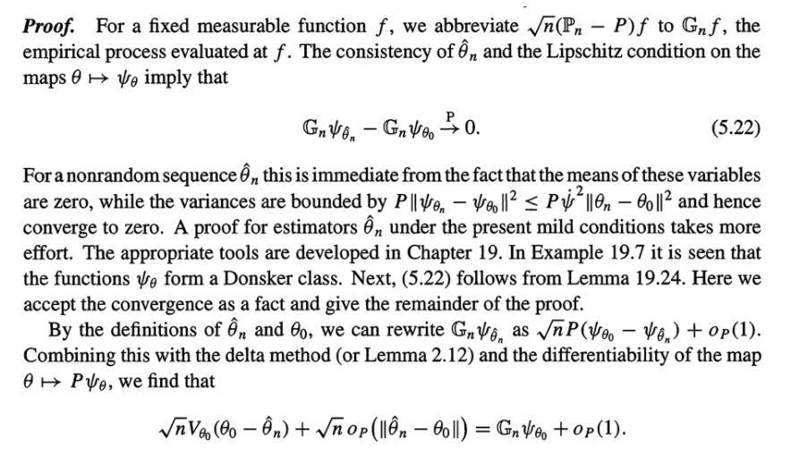
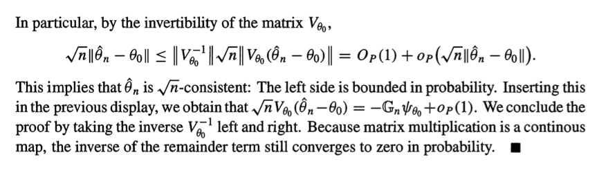

class: center, middle

# 代数幾何と学習理論 6.4節
---
### 6.4 ML and MAP
前節まではBayes推定量を扱った．

この節は ML(最尤法; Maximum likelihood) と MAP(事後確率最大化法; Maximum a posteriori) を含むクラスの推定量を考察する：

$$
\begin{split}
\hat w\_n &\in \mathop{\rm arg~min}\limits\_{w \in W} \sum\_{i=1}^n f(X\_i, w) + a\_n \sigma(w), \\\\
\text{ここで} \\\\
\\{a\_n\\}\_{n=1}^\infty&: \text{non-decreasing}, \\\\
\sigma(w) \geq 0&,\ \forall w \in W.
\end{split}
$$

特に

$$
\begin{split}
\begin{cases}
a\_n = 0&;\quad \sigma = (\text{なんでも}) &\leadsto \text{ML}, \\\\
a\_n = 1&;\quad \sigma(w) = \log \varphi(w) - (\min_{w'}\log \varphi(w')) &\leadsto \text{MAP}
\end{cases}
\end{split}
$$
($\varphi$は事前分布.$\sigma(w)\geq 0$を仮定できるのは$K$がコンパクトだから)
---
### 6.4 ML and MAP 道筋
まずはともあれ一致性を示す．

#### Def(参考). (一致性)
推定量 $\hat w\_n$ が $w\_0 \in W\_0$ に対して一致性を持つ

$\overset{\Delta}{\Leftrightarrow}$

$$
\hat w\_n \overset{p}{\to} W\_0 \\\\
$$
i.e.
$$
\forall M > 0, P(\|\hat w\_n - w\_0\| \geq M) \to 0 (n \to \infty)
$$
---
### 6.4 ML and MAP 道筋
まずはともあれ一致性を示す．
#### Def. (集合への一致性; ここだけ？)
推定量 $\hat w\_n$ が $W\_0 \subset W$ に対して一致性を持つ

$\overset{\Delta}{\Leftrightarrow}$

$$
\hat w\_n \overset{p}{\to} W\_0. \\\\
(\text{注意: ここだけ？})
$$
i.e.
$$
P(\hat w\_n \not \in W\_0) \to 0 (n \to \infty)
$$

---
### 6.4 ML and MAP 道筋
一致性を示したら，近づき方を見る．

一致性から，推定量の変動は0に近づくので，そのまま極限に飛ばすと変動の様子は取り出せない

$\leadsto$ 収束先との差を$n$倍や$\sqrt{n}$倍などした後に，$n \to \infty$して収束を調べる(確率収束や分布収束，とくに分布収束)．

---
### 6.4 ML and MAP 道筋
#### Thm(参考). (正則な場合の，漸近正規性の定理の例)
.center[]
(source: [1])
---
### 6.4 ML and MAP 道筋
#### Thm(参考). (正則な場合の，漸近正規性の定理の例)
.center[]
(source: [1])
---
### 6.4 ML and MAP 道筋
#### Thm(参考). (正則な場合の，漸近正規性の定理の例)
.center[]
(source: [1])
---
### 6.4 ML and MAP 道筋
今の場合，一致性は$\forall \epsilon > 0, \ P(K(\hat w\_n) > \epsilon) \to 0$をみる．
漸近挙動は$R\_g := K(\hat w)$や$R\_t := K\_n(\hat w)$の挙動を見る.sup.red[\\*]

.footnote[.red[\\*] $\sqrt{n}(\hat w\_n - w\_0)$ の漸近挙動ではなく$R\_g$の挙動を知りたいのは，$w\_0$に興味がないからだろう．]

$$
\begin{split}
E\_q[R\_g], E\_q[R\_t]
\end{split}
$$
を調べる．これらは漸近的には0に近づく．そのため$n$倍に拡大した挙動を調べる．
---
### 6.4 ML and MAP 道筋
$$
\begin{split}
nE\_q[R\_g], \\\\
nE\_q[R\_t]
\end{split}
$$

これは(サンプルの分布による積分ひいては)$\hat w\_n$という特異点を持つ集合($W\_0$)に確率収束をしていくような確率変数の分布での積分になっている．(check → @todo)

$\hat w\_n$自身が分布収束しない.sup.red[[1]]ので，積分の極限操作ができない．そのため，特異点を正規交差型に解消した方のパラメーター空間で
$$
\xi\_n(u) := \sum\_{i=1}^n \frac{K(w) - f(X\_i, w)}{\sqrt{nK(w)}}
$$
を調べる($\xi\_n$なら分布収束し，しかも積分の極限移行ができる.sup.red[[2]])．

.footnote[
.red[[1]] 特異点のせいで？check @todo

.red[[2]] Why?
]

---
## Reference
[1] van der Vaart, A. W. Asymptotic Statistics. (Cambridge University Press, 2000).
